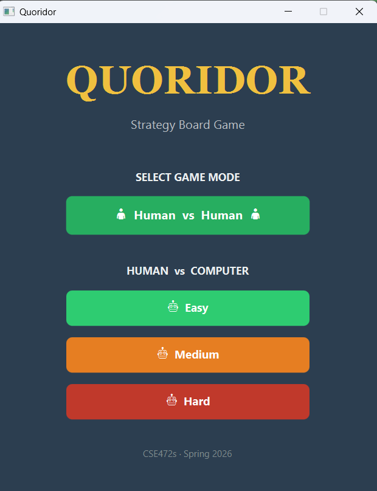
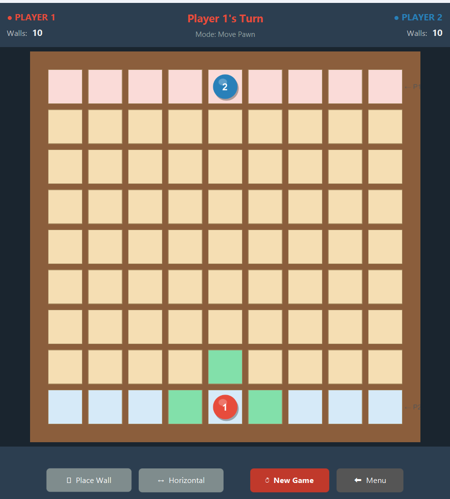
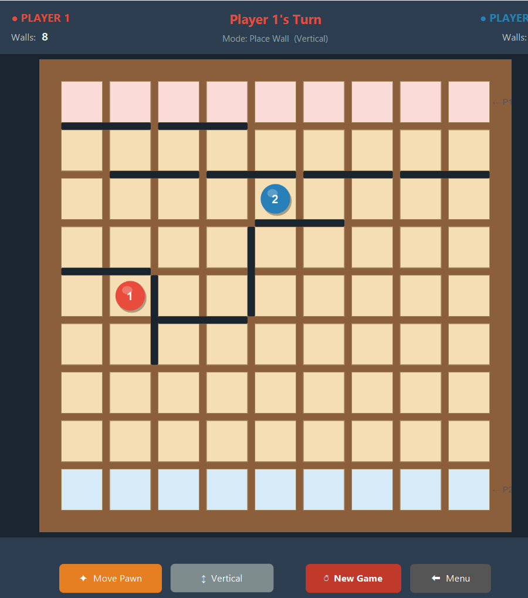
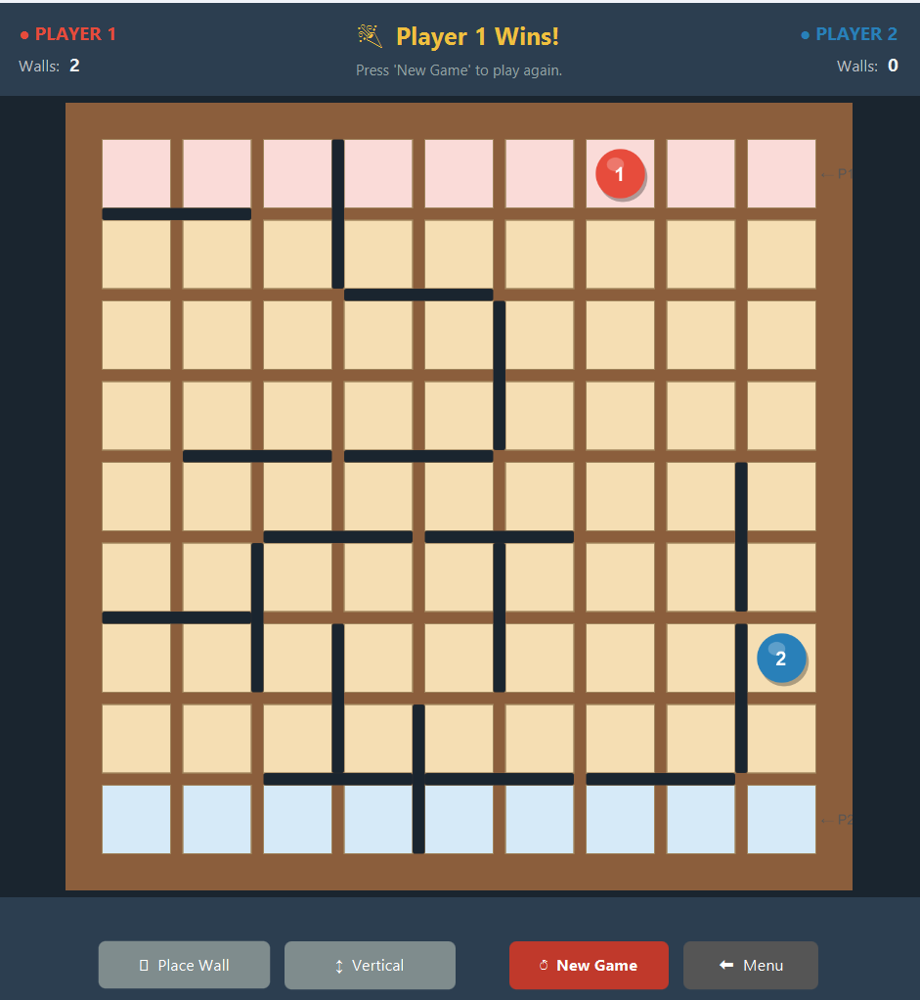

# Quoridor — AI Strategy Board Game

A desktop implementation of the classic **Quoridor** board game built with **Java** and **JavaFX**. The game features a full graphical interface, complete rule enforcement, and an AI opponent with three difficulty levels powered by the **Minimax algorithm with Alpha-Beta Pruning**.

## Game Description

**Quoridor** is a two-player strategy board game played on a **9×9 grid**. Each player controls a pawn and starts on opposite sides of the board.

### Objective
- **Player 1**  starts at the bottom center and must reach the **top row** (row 0).
- **Player 2**  starts at the top center and must reach the **bottom row** (row 8).
- The **first player** to reach their goal row **wins** the game.

### Rules
- Players take turns. On each turn a player can either:
  1. **Move their pawn** one step in any cardinal direction (up, down, left, right).
  2. **Place a wall** to block the opponent's path.
- Each player has **10 walls** to place throughout the game.
- Walls span **two cells** and can be placed **horizontally** or **vertically**.
- **Jumping**: If your pawn is adjacent to the opponent, you can jump over them. If a wall blocks the straight jump, diagonal jumps are allowed.
- **Path rule**: A wall placement is only valid if **both players** still have at least one path to their goal row after the wall is placed.

### Game Modes
| Mode | Description |
|------|-------------|
| **Human vs Human** | Two players take turns on the same screen |
| **Human vs AI (Easy)** | AI uses a greedy BFS strategy — always moves toward the goal, never places walls |
| **Human vs AI (Medium)** | AI uses Minimax search (depth 2) with strategic wall placement |
| **Human vs AI (Hard)** | AI uses Minimax search (depth 3) with Alpha-Beta Pruning, advanced wall selection, and anti-oscillation heuristics |

---

## Screenshots

### Main Menu

### Gameplay — Early Game

### Gameplay — Mid 

### Game Over

---

## Installation and Running Instructions

### Prerequisites
- **Java JDK 11** or higher
- **Apache NetBeans IDE** (version 12 or higher recommended)
- **Apache Maven** (bundled with NetBeans)

### Step-by-Step Setup in NetBeans

1. **download** the project to your local machine.

2. **Open the project in NetBeans**

3. **Resolve dependencies**:
   - Right-click on the project in the **Projects** panel.
   - Select `Build with Dependencies` — Maven will automatically download JavaFX 13 and all required libraries.

4. **Run the project**

---

## Controls Explanation

### Pawn Movement (Default Mode)
- The game starts in **Move Pawn** mode.
- **Green-highlighted cells** on the board show all valid moves for the current player.

### Wall Placement
- Click the **Place Wall** button at the bottom to switch to wall placement mode.
- Use the **Horizontal / Vertical** toggle button to choose the wall orientation.
- **Hover** over the board to see a **semi-transparent orange preview** of where the wall will be placed.
- **Click** to place the wall. If the placement is invalid (overlaps, crosses, or blocks all paths), a warning appears.
- Click **Move Pawn** to switch back to pawn movement mode.

### Status Indicators

| Indicator | Location | Description |
|-----------|----------|-------------|
| **Player 1 / Player 2 Walls** | Top bar (left & right) | Shows remaining walls for each player |
| **Turn Indicator** | Top bar (center) | Displays whose turn it is, or "Computer is thinking…" during AI turns |
| **Mode Label** | Top bar (below turn) | Shows current mode: Move Pawn or Place Wall (with orientation) |
| **Message Area** | Bottom bar (above buttons) | Displays warnings for invalid moves or wall placements |

---

## Demo Video

[**Click here to watch the demo video**](https://drive.google.com/drive/folders/16eMxN8A454wX3pF5Lz0_PzPqQCi2bJ0N?usp=drive_link)

---
